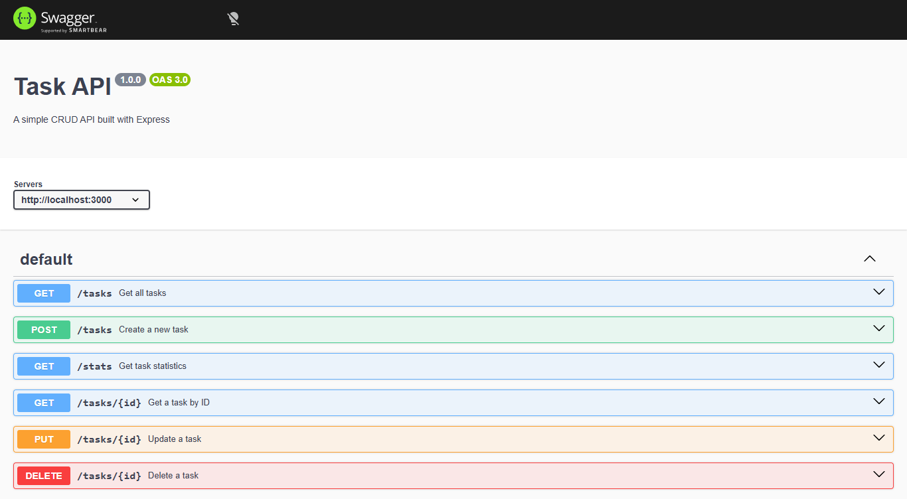
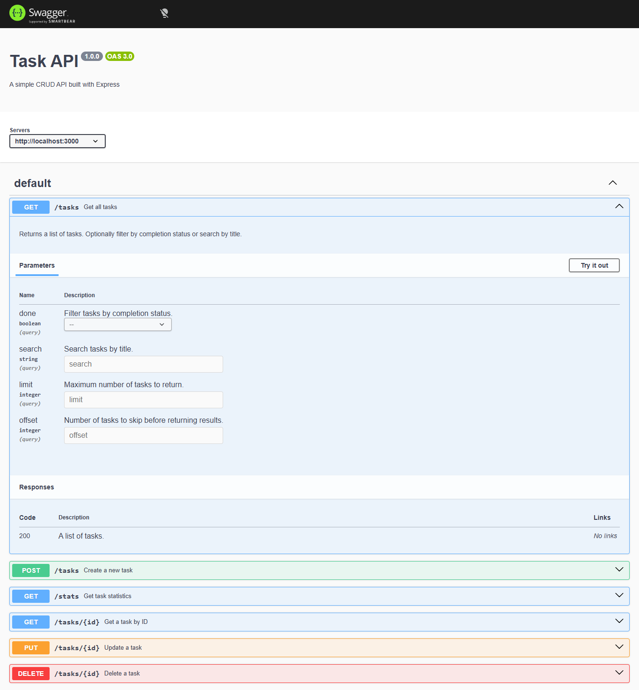
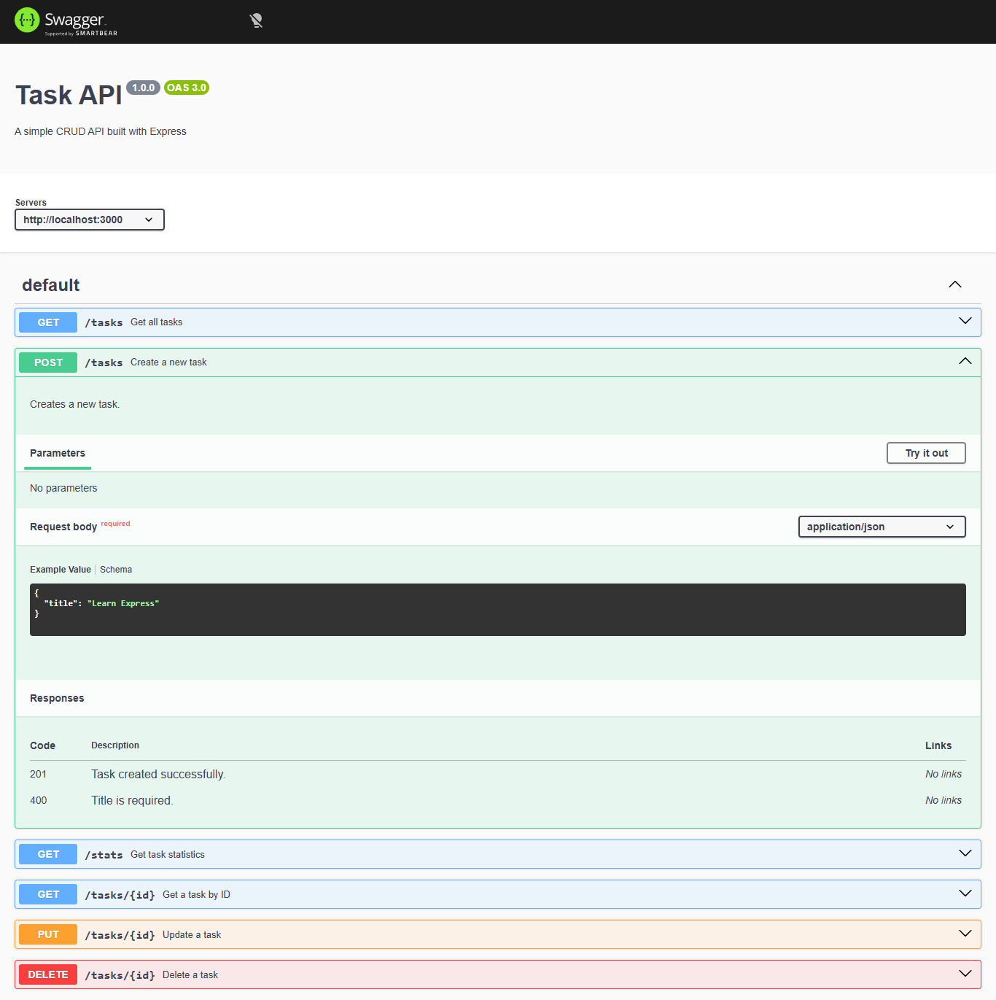
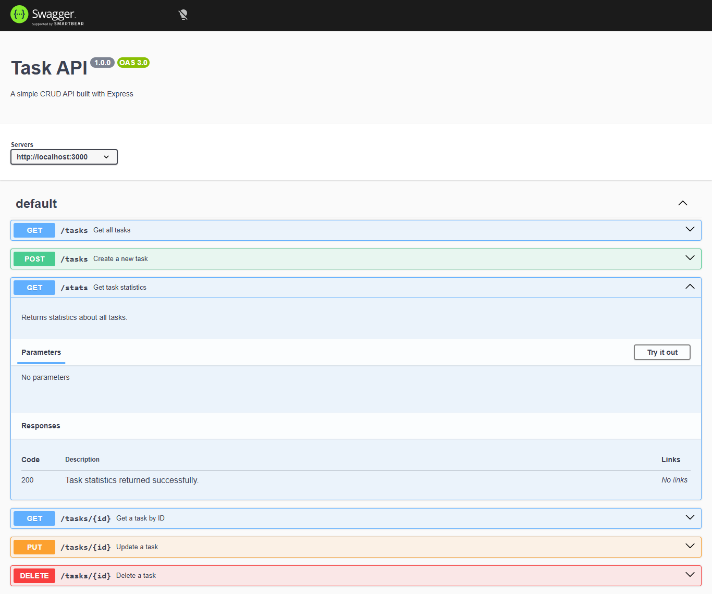
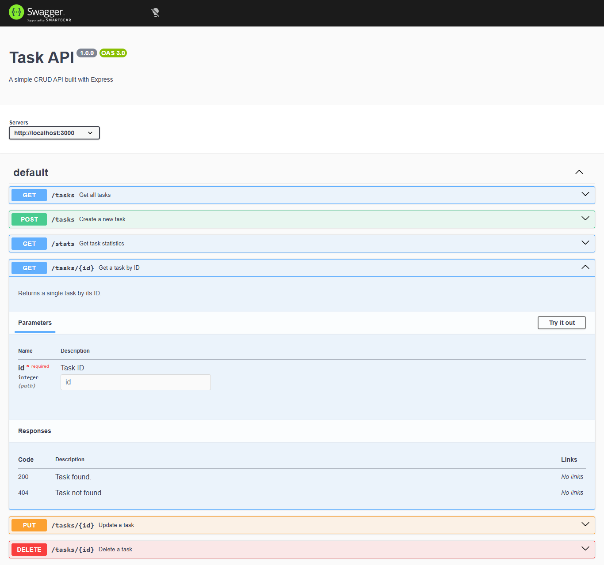
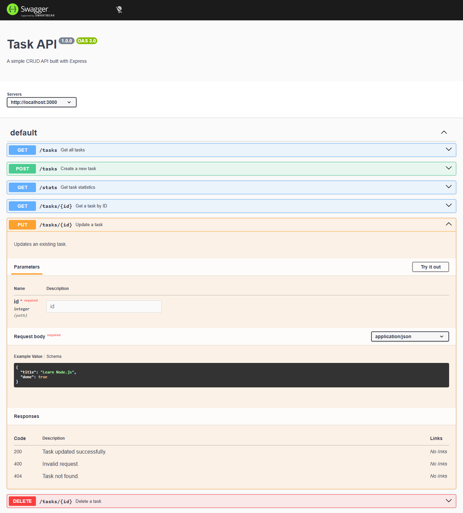
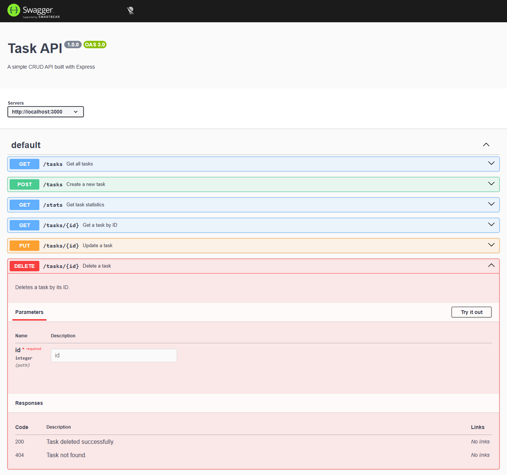

# Task Management API

A RESTful Task Management API built with **Node.js** and **Express**. The API stores tasks in memory (no database) and supports full CRUD operations, filtering, searching, pagination, task statistics, and interactive Swagger documentation.

---

## Features

- Full CRUD Task Management
- Input Validation
- Proper HTTP Status Codes
- Interactive Swagger Documentation
- Task Statistics (`/stats`)
- Filtering (`?done=true`)
- Searching (`?search=study`)
- Pagination (`?limit=2&offset=0`)
- Tested using Postman and Swagger UI

---

## Technologies Used

- Node.js
- Express.js
- Swagger UI Express
- Swagger JSDoc
- Git & GitHub
- Postman

---

## Installation

Clone the repository:

```bash
git clone https://github.com/Rameenkhan262/flyrank-backend.git
```

Install dependencies:

```bash
npm install
```

Run the server:

```bash
node app.js
```

The server will start at:

```
http://localhost:3000
```

Swagger Documentation:

```
http://localhost:3000/api-docs
```

---

# API Endpoints


The following endpoints are available in the Task Management API:


| Method | Endpoint | Description |
|---------|----------|-------------|
| GET | / | API information |
| GET | /health | Health check |
| GET | /tasks | Get all tasks |
| GET | /tasks/:id | Get a task by ID |
| POST | /tasks | Create a task |
| PUT | /tasks/:id | Update a task |
| DELETE | /tasks/:id | Delete a task |
| GET | /stats | Task statistics |

---

## Query Parameters

### Filtering

```
GET /tasks?done=true
```

Returns only completed tasks.

```
GET /tasks?done=false
```

Returns only pending tasks.

---

### Searching

```
GET /tasks?search=study
```

Searches tasks by title.

---

### Pagination

```
GET /tasks?limit=2&offset=0
```

Returns the first two tasks.

```
GET /tasks?limit=2&offset=2
```

Returns the next page.

---

## Example curl Commands

Get all tasks:

```bash
curl.exe -i http://localhost:3000/tasks
```

Create a task:

```bash
curl.exe -X POST http://localhost:3000/tasks ^
-H "Content-Type: application/json" ^
-d "{\"title\":\"Learn Express\"}"
```

Update a task:

```bash
curl.exe -X PUT http://localhost:3000/tasks/1 ^
-H "Content-Type: application/json" ^
-d "{\"title\":\"Learn Node.js\",\"done\":true}"
```

Delete a task:

```bash
curl.exe -X DELETE http://localhost:3000/tasks/1
```

---

## Example `curl -i` Output

```text
HTTP/1.1 200 OK
X-Powered-By: Express
Content-Type: application/json; charset=utf-8
Content-Length: 137
ETag: W/"89-Zxuej7mVvQUkYyhzyIVnLDwxUwk"
Date: Tue, 21 Jul 2026 22:52:33 GMT
Connection: keep-alive
Keep-Alive: timeout=5

[
  {
    "id": 1,
    "title": "Buy Milk",
    "done": false
  },
  {
    "id": 2,
    "title": "Study Express",
    "done": true
  },
  {
    "id": 3,
    "title": "Finish Assignment",
    "done": false
  }
]
```
---


## HTTP Status Codes

| Code | Meaning |
|------|---------|
| 200 | Success |
| 201 | Resource Created |
| 400 | Invalid Request |
| 404 | Resource Not Found |

---

## Swagger Documentation

Interactive API documentation is available at:

http://localhost:3000/api-docs

### Home Page



### GET /tasks




### POST /tasks



### GET /stats



### GET /tasks/{id}




### PUT /tasks/{id}



### DELETE /tasks/{id}




# AI vs Me

## Prompt

Build a RESTful Task Management API using Node.js and Express.

Requirements:

- Use an in-memory array
- Full CRUD operations
- Input validation
- Proper HTTP status codes
- Filtering
- Searching
- Pagination
- Task statistics endpoint
- Swagger documentation

---

## What AI did better

- Generated a cleaner project structure.
- Separated routes into different files.
- Added middleware and data modules.
- Produced a detailed README automatically.

---

## What I did better

- Built every endpoint manually.
- Understood how Express routing works.
- Implemented filtering, searching, pagination, and Swagger step by step.
- Tested every endpoint using the browser, Postman, and Swagger.

---

## What I learned

Building the project manually first helped me understand Express routing, middleware, request validation, and REST API design. This made it easier to evaluate AI-generated code, identify mistakes, and confidently debug issues when they occurred.
---

## Future Improvements

- Connect to MongoDB or MySQL
- Add JWT Authentication
- Add User Accounts
- Store data permanently in a database
- Add automated testing
- Deploy to Render or Railway

---

## Project Structure

```text
Backend-Week2/
│── app.js
│── package.json
│── package-lock.json
│── README.md
│── .gitignore
└── images/
```
---


## Author

Developed as part of the **FlyRank Backend Internship**.


---

## License

This project was developed for educational purposes as part of the FlyRank Backend Internship.
