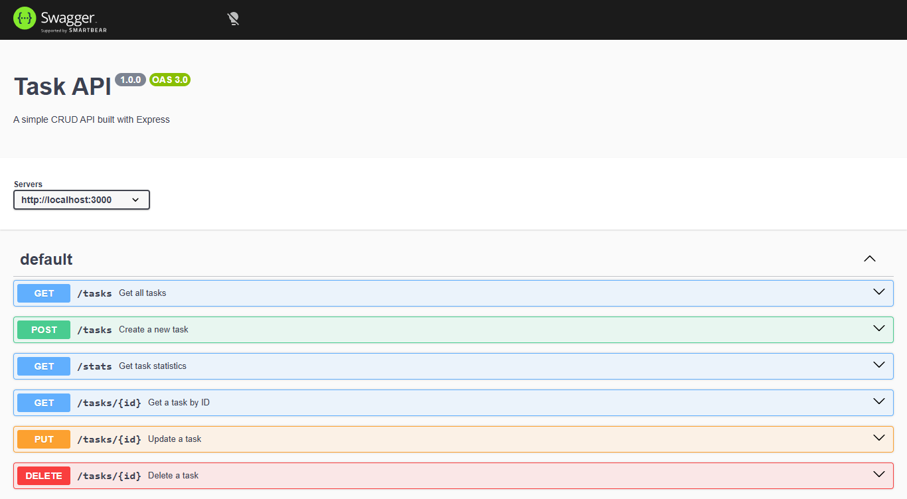
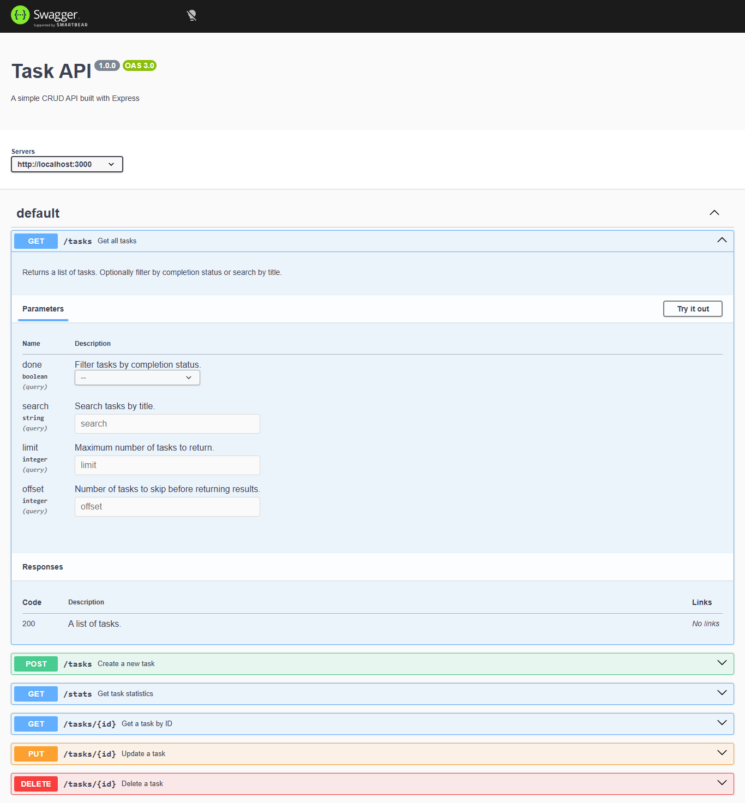
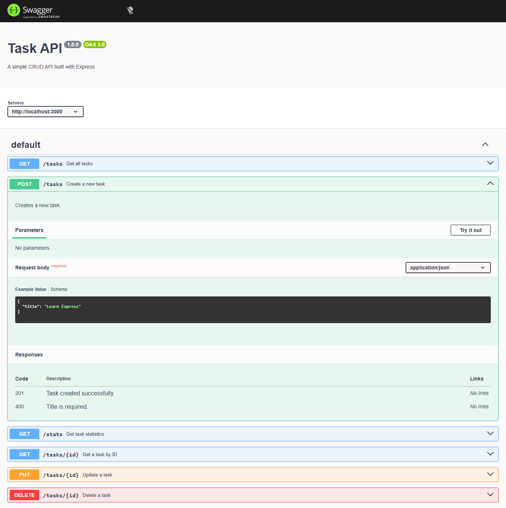
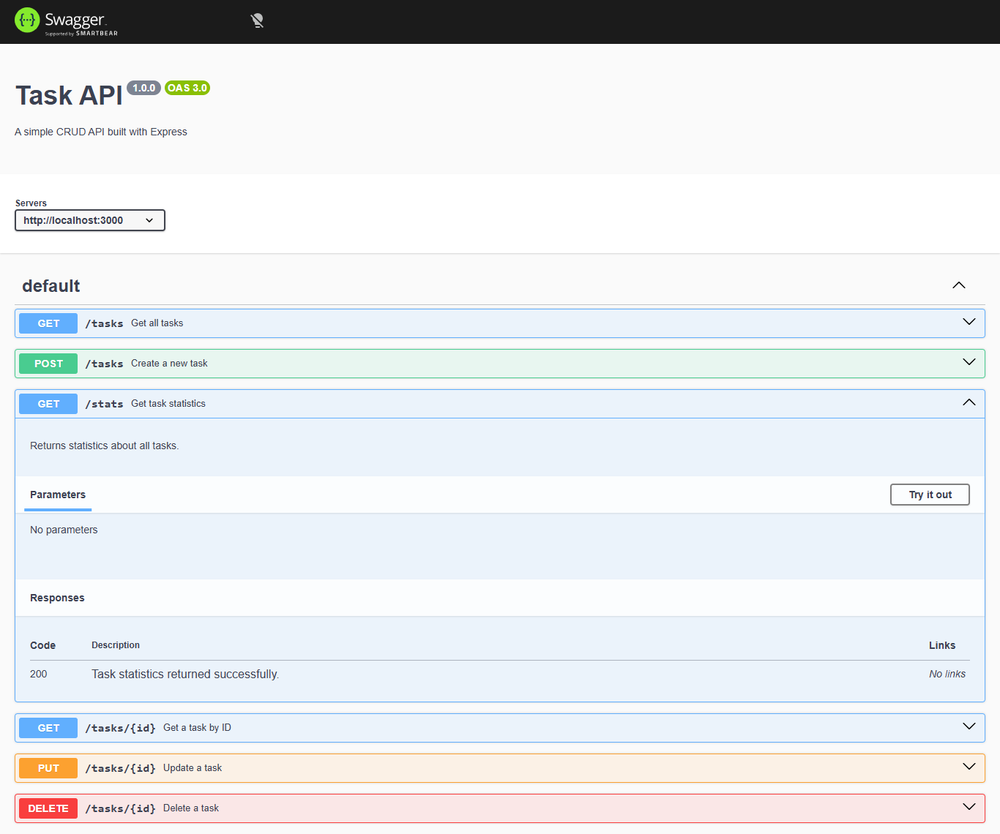
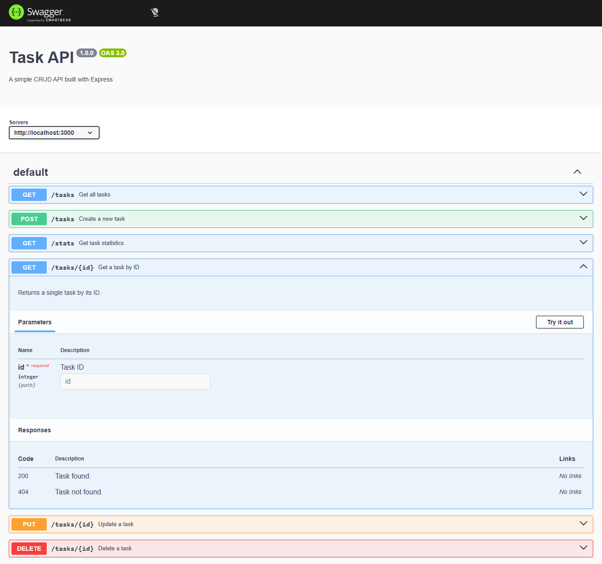
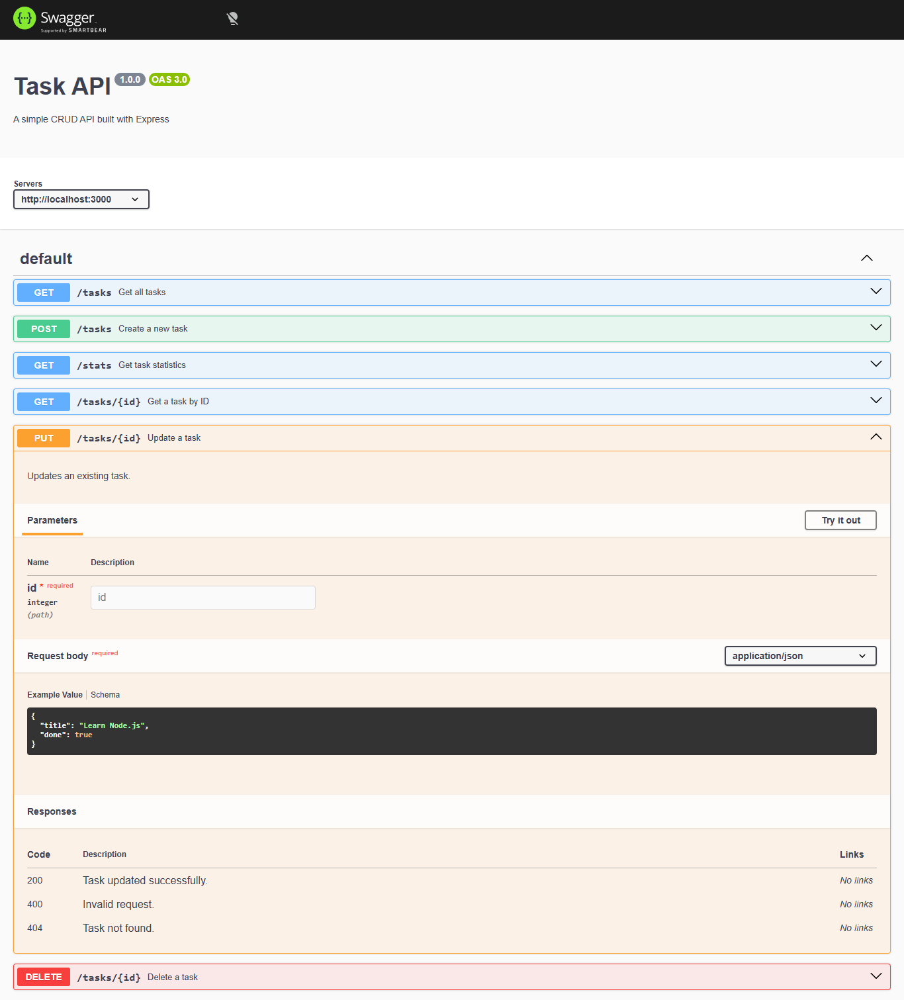
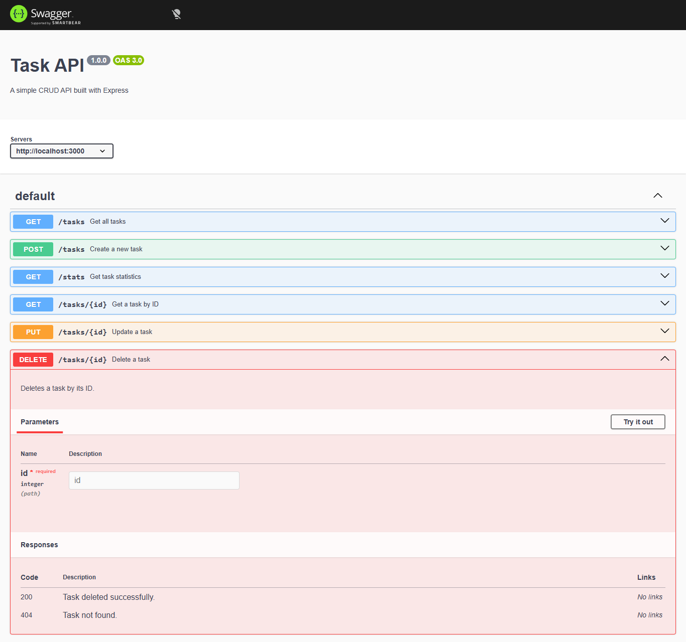
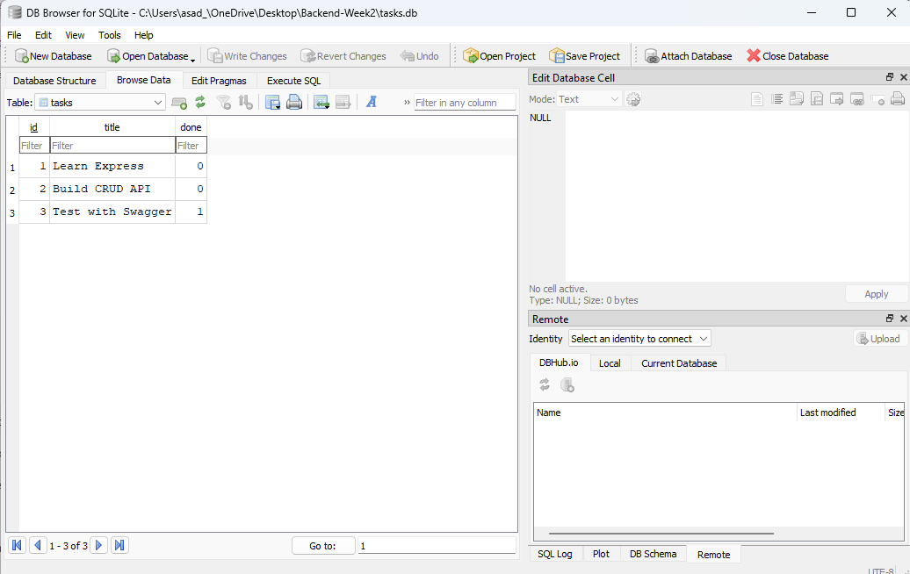

# Task Management API

A RESTful Task Management API built with **Node.js** and **Express**. The API stores tasks in memory (no database) and supports full CRUD operations, filtering, searching, pagination, task statistics, and interactive Swagger documentation.

---

## Features

- Full CRUD Task Management
- Input Validation
- Proper HTTP Status Codes
- Interactive Swagger Documentation
- Task Statistics (`/stats`)
- Filtering (`?done=true`)
- Searching (`?search=study`)
- Pagination (`?limit=2&offset=0`)
- Tested using Postman and Swagger UI

---

## Technologies Used

- Node.js
- Express.js
- Swagger UI Express
- Swagger JSDoc
- Git & GitHub
- Postman

---

## Installation

Clone the repository:

```bash
git clone https://github.com/Rameenkhan262/flyrank-backend.git
```

Install dependencies:

```bash
npm install
```

Run the server:

```bash
node app.js
```

The server will start at:

```
http://localhost:3000
```

Swagger Documentation:

```
http://localhost:3000/api-docs
```

---

# API Endpoints


The following endpoints are available in the Task Management API:


| Method | Endpoint | Description |
|---------|----------|-------------|
| GET | / | API information |
| GET | /health | Health check |
| GET | /tasks | Get all tasks |
| GET | /tasks/:id | Get a task by ID |
| POST | /tasks | Create a task |
| PUT | /tasks/:id | Update a task |
| DELETE | /tasks/:id | Delete a task |
| GET | /stats | Task statistics |

---

## Query Parameters

### Filtering

```
GET /tasks?done=true
```

Returns only completed tasks.

```
GET /tasks?done=false
```

Returns only pending tasks.

---

### Searching

```
GET /tasks?search=study
```

Searches tasks by title.

---

### Pagination

```
GET /tasks?limit=2&offset=0
```

Returns the first two tasks.

```
GET /tasks?limit=2&offset=2
```

Returns the next page.

---

## Example curl Commands

Get all tasks:

```bash
curl.exe -i http://localhost:3000/tasks
```

Create a task:

```bash
curl.exe -X POST http://localhost:3000/tasks ^
-H "Content-Type: application/json" ^
-d "{\"title\":\"Learn Express\"}"
```

Update a task:

```bash
curl.exe -X PUT http://localhost:3000/tasks/1 ^
-H "Content-Type: application/json" ^
-d "{\"title\":\"Learn Node.js\",\"done\":true}"
```

Delete a task:

```bash
curl.exe -X DELETE http://localhost:3000/tasks/1
```

---

## Example `curl -i` Output

```text
HTTP/1.1 200 OK
X-Powered-By: Express
Content-Type: application/json; charset=utf-8
Content-Length: 137
ETag: W/"89-Zxuej7mVvQUkYyhzyIVnLDwxUwk"
Date: Tue, 21 Jul 2026 22:52:33 GMT
Connection: keep-alive
Keep-Alive: timeout=5

[
  {
    "id": 1,
    "title": "Buy Milk",
    "done": false
  },
  {
    "id": 2,
    "title": "Study Express",
    "done": true
  },
  {
    "id": 3,
    "title": "Finish Assignment",
    "done": false
  }
]
```
---


## HTTP Status Codes

| Code | Meaning |
|------|---------|
| 200 | Success |
| 201 | Resource Created |
| 400 | Invalid Request |
| 404 | Resource Not Found |

---

## Swagger Documentation

Interactive API documentation is available at:

http://localhost:3000/api-docs

### Home Page



### GET /tasks




### POST /tasks



### GET /stats



### GET /tasks/{id}




### PUT /tasks/{id}



### DELETE /tasks/{id}




# AI vs Me

## Prompt

Build a RESTful Task Management API using Node.js and Express.

Requirements:

- Use an in-memory array
- Full CRUD operations
- Input validation
- Proper HTTP status codes
- Filtering
- Searching
- Pagination
- Task statistics endpoint
- Swagger documentation

---

## What AI did better

- Generated a cleaner project structure.
- Separated routes into different files.
- Added middleware and data modules.
- Produced a detailed README automatically.

---

## What I did better

- Built every endpoint manually.
- Understood how Express routing works.
- Implemented filtering, searching, pagination, and Swagger step by step.
- Tested every endpoint using the browser, Postman, and Swagger.

---

## What AI got wrong

The AI-generated version did not fully match the assignment requirements. It initially missed some validation rules, such as returning the correct `400 Bad Request` response for invalid input, and some response formats differed from my implementation. It also made different design choices that were not specified in my prompt, so I had to carefully review and compare the generated code before considering it correct.

---

## What my prompt forgot

My original prompt did not specify every implementation detail. I forgot to clearly mention the exact response formats, required HTTP status codes for every endpoint, and that the API should use only an in-memory array with no database. Because those details were missing, the AI made its own assumptions instead of following the exact assignment requirements.

---

## One Rematch

After reviewing the AI-generated code, I improved my prompt by explicitly specifying the required endpoints, validation rules, HTTP status codes, response formats, in-memory storage, and Swagger documentation. The regenerated version was much closer to my hand-built API and required fewer corrections.

## What I learned

Building the project manually first helped me understand Express routing, middleware, request validation, and REST API design. This made it easier to evaluate AI-generated code, identify mistakes, and confidently debug issues when they occurred.
---

## Future Improvements

- Connect to MongoDB or MySQL
- Add JWT Authentication
- Add User Accounts
- Migrate from SQLite to PostgreSQL for production deployment
- Add automated testing
- Deploy to Render or Railway

---

## Project Structure

```text
Backend-Week2/
│── app.js
│── package.json
│── package-lock.json
│── README.md
│── .gitignore
└── images/
```
---

## Week 3 – SQLite Database Integration

### Why SQLite?

This project was upgraded from an in-memory task list to a SQLite database to provide persistent data storage. SQLite was chosen because it is lightweight, serverless, stores all data in a single file, and requires no additional database installation or configuration. Unlike the previous implementation, data now survives server restarts. This allows tasks created through the API to remain available even after the server is stopped and started again.

### Database

- Database file: `tasks.db`
- Created automatically when the application starts.
- The `tasks` table is created automatically if it does not already exist.
- Three sample tasks are seeded only on the first run when the database is empty.
- `tasks.db` is included in `.gitignore`, so every cloned project starts with a fresh database.

### Running the Project

Start the application with:

```bash
node app.js
```

The server will automatically:

- Create `tasks.db` if it does not exist.
- Create the `tasks` table if it is missing.
- Insert the three sample tasks on the first run only.

### Example SQL Query

```sql
SELECT * FROM tasks;
```

**Explanation:**

This query retrieves every task stored in the tasks table and displays all records currently available in the SQLite database.

### SQLite Database Screenshot

The screenshot below shows the SQLite database opened in **DB Browser for SQLite**.


*Figure 1: SQLite database viewed in DB Browser for SQLite showing the seeded tasks.*


## Optional Enhancements

Beyond the required assignment features, the following improvements were implemented:

- SQL-based search using the `LIKE` operator
- SQL-based filtering using `WHERE done = ?`
- SQL-based alphabetical sorting using `ORDER BY title`
- Dynamic SQL query construction for cleaner endpoint logic
- SQL-based task statistics using `COUNT(*)`
- Transaction-based database seeding
- SQLite index on the `title` column to improve search performance
- Automatic `created_at` and `updated_at` timestamps

# AI vs Me

## Prompt

```
Migrate an existing Express.js Task Management API from in-memory storage to SQLite using better-sqlite3.

Requirements:

- Use better-sqlite3 as the database library.
- Create tasks.db automatically if it does not exist.
- Create the tasks table automatically if it does not exist.
- Seed exactly three sample tasks only when the table is empty.
- Keep all existing endpoints unchanged:
  - GET /tasks
  - GET /tasks/:id
  - POST /tasks
  - PUT /tasks/:id
  - DELETE /tasks/:id
  - GET /stats
- Preserve the same request and response formats.
- Continue using the same HTTP status codes (200, 201, 204, 400, 404).
- Use parameterized SQL queries for all database operations.
- Store boolean values as integers (0/1) and convert them back to true/false in API responses.
- Keep Swagger documentation working.
- Do not change the API behaviour—only replace the storage layer.
```

---

## What AI Did Well

The AI successfully generated SQLite CRUD queries, used parameterized SQL statements, and created the database automatically. It also preserved the existing API endpoints and produced a working migration from in-memory storage to SQLite.

---

## What AI Got Wrong

The first generated version did not fully match the assignment requirements. Some issues included:

- Search and filtering were initially performed in JavaScript instead of SQL.
- Statistics were calculated from the old in-memory array instead of querying the database.
- The solution did not include SQL sorting using `ORDER BY`.
- Transaction-based seeding was not implemented.
- SQLite indexes and timestamps were not included.
- The README documentation required additional improvements.

These issues were corrected manually during development.

---

## What My Prompt Forgot

Although the prompt described the database migration, it did not explicitly request:

- SQL-based searching using `LIKE`
- SQL filtering using `WHERE done = ?`
- SQL sorting using `ORDER BY`
- SQL-based statistics using `COUNT(*)`
- Transaction-based seeding
- SQLite indexes
- `created_at` and `updated_at` timestamps

Because these requirements were not specified, the AI generated a simpler implementation.

---

## One Rematch

### Improved Prompt

```
Migrate the Express.js Task API from in-memory storage to SQLite using better-sqlite3.

Requirements:

- Keep all endpoints and HTTP status codes unchanged.
- Use parameterized SQL queries only.
- Perform searching using SQL LIKE.
- Perform filtering using SQL WHERE clauses.
- Perform sorting using ORDER BY.
- Compute statistics using SQL COUNT(*).
- Seed data inside a transaction.
- Add an index on the title column.
- Add created_at and updated_at timestamps.
- Keep Swagger documentation unchanged.
- Do not change the external API behaviour.
```

### What Changed

After improving the prompt, the expected implementation became much closer to the final hand-built solution because it explicitly described the SQL behaviour instead of only requesting a database migration.

---

## What I Learned

Building the SQLite migration manually before comparing it with AI helped me understand database design, SQL queries, transactions, indexing, and API migration. I also learned that AI produces much better code when requirements are specific and complete. Clear prompts result in better implementations, while vague prompts leave important design decisions to the AI.


## Author

Developed as part of the **FlyRank Backend Internship**.


---

## License

This project was developed for educational purposes as part of the FlyRank Backend Internship.
